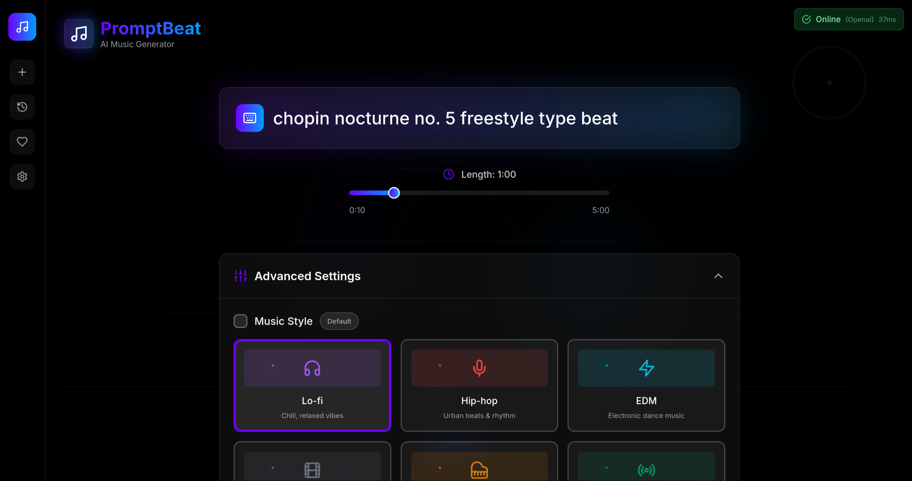

# 🎹 PromptBeat AI  

**One prompt to a finished beat in seconds.**  
A colorful visualization of your track, intuitive sliders, and the ability to download your creations. No DAW required.

## How to run

### Web-app

Go to the [website](https://promptbeatai.ptaqqqq.hackclub.app).

### Locally

Update your `.env` with the following:

- `OPENAI_API_KEY` or `GEMINI_API_KEY` - only one of them is required
- `BACKEND_PORT` and `FRONTEND_PORT`
- `VITE_API_BASE_URL` - you will probably set this to `localhost:{BACKEND_PORT}`
- `ALLOWED_ORIGINS` with the origin address (if backend is on :8000 and frontend on :5173 it should be optional)

Set EXPOSE and CMD ports in `./Dockerfile` and `./frontend/project/Dockerfile`.

Then simply run:

`docker compose up --build`

  

